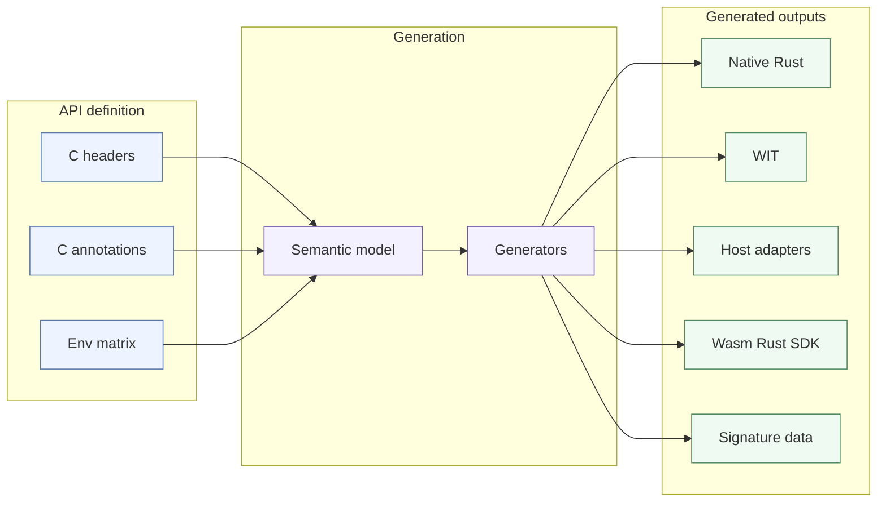
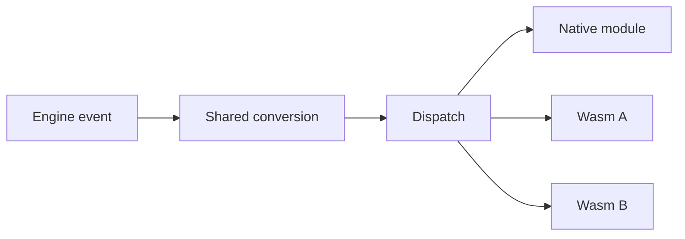

# Recoil Wasm Architecture

Validated conceptually against the current `rust-wip` NativeInterface/Rust design.

This document is intentionally high-level. Detailed API/codegen, runtime ABI, execution-environment, sandbox/determinism, parity, and implementation material is split into separate documents.

## Goal

Add Wasm as a first-class module backend alongside native modules.

The important properties are:

- the same Spring engine API remains authoritative;
- Rust module code can target native or Wasm with minimal source changes;
- Wasm modules cannot access the host OS except through engine APIs explicitly exposed to them;
- synced Wasm execution is deterministic;
- the full API surface is generated rather than hand-wrapped;
- multiple Wasm modules can run independently;
- native, Lua, and Wasm surfaces are continuously checked for parity.

Wasm is the portable/sandboxed module format. Native-module loading policy is a separate engine concern and is not part of this design.

## Core design

The native C ABI and the Wasm ABI are different transports over the same semantic Spring API.

`NativeInterface` remains the implementation backend. Wasm adapters translate between the Wasm representation and existing NativeInterface query/result calls; they do not reimplement engine behavior.

## Main pieces

### 1. Semantic API model

Generalize the existing `spring-native-codegen` parser into a shared semantic model.

It must understand concepts such as strings, lists, records, options, errors, enums, handles, callbacks, mutation, and execution-environment availability instead of only C pointer/layout shapes.

See [API & Code Generation](recoil_wasm_api_codegen.md).

### 2. Execution environments

A Wasm instance belongs to one Spring execution environment. The environment determines which Spring APIs and callins exist and whether the instance is synced.

Initial environments mirror the in-game Lua roles:

- LuaRules synced;
- LuaRules unsynced;
- LuaGaia synced;
- LuaGaia unsynced;
- LuaUI later, after its restricted-read semantics are implemented.

Synced and unsynced Wasm are separate instances and do not share mutable guest state.

See [Execution Environments](recoil_wasm_execution_environments.md).

### 3. Wasm runtime/backend

Use Wasmtime as the initial runtime and WIT/Component Model as the initial ABI.

The engine owns:

- Wasm module loading;
- instance/store lifetime;
- import registration;
- callout adapters;
- callin dispatch;
- resource/fuel/memory limits;
- callbacks/resources;
- deterministic configuration.

A small C++ vertical slice must validate the exact pinned Wasmtime version before the full generator is built.

See [Runtime & ABI](recoil_wasm_runtime_abi.md).

### 4. Rust module API

Native and Wasm should expose the same high-level Rust concepts.

The default public representation is safe owned semantic data rather than raw pointer-bearing `sys::*` records. Native and Wasm can have different internal transport mechanics while presenting the same module-facing API.

The application-level target is:

- same module trait/callin structure;
- same Spring callout API;
- same semantic value types;
- build/target/environment configuration selects native versus Wasm.

### 5. Callouts

The generated host adapter validates/lifts arguments, calls the existing NativeInterface function, and lowers the result back to Wasm.

No Spring behavior is duplicated in `WasmInterface`.

### 6. Callins

Keep the existing `NativeInterfaceEventClient` engine-object-to-public-event conversion shared. Refactor only the final dispatch so it can target native or Wasm instances.

Callin applicability, defaults, aliases, and result aggregation must come from one canonical inventory.

### 7. Multiple modules

Wasm is N-instance from the start.

Each module instance has independent:

- memory/store;
- execution environment;
- resource/handle state;
- callback state;
- limits/fuel;
- fault lifecycle.

For synced modules, module identity and deterministic dispatch order are part of match configuration.

### 8. Sandbox and synced execution

Wasm itself is the sandbox boundary.

The engine does not give Wasm generic filesystem, network, process, environment, clock, entropy, or native-pointer access. Any functionality available to a Wasm module comes from the Spring API deliberately registered for its environment.

Synced Wasm additionally uses a deterministic runtime configuration, engine-controlled RNG/host behavior, deterministic limits, and cross-platform sync tests.

See [Sandbox & Determinism](recoil_wasm_sandbox_determinism.md).

### 9. Parity

Three related gates are required:

- generated API/signature equivalence;
- runtime Lua/native/Wasm result parity;
- cross-platform synced determinism.

The existing native/Lua tooling is useful, but it must become a real automated gate rather than a report-only workflow.

See [Parity & Testing](recoil_wasm_parity_testing.md).

## Scope

In scope:

- in-game LuaRules/LuaGaia equivalents;
- later LuaUI equivalent;
- full generated Spring API appropriate to those environments;
- Rust native/Wasm source parity;
- RmlUi and Gfx;
- deterministic synced Wasm;
- multiple Wasm modules.

Out of scope for this design:

- defining how native modules are trusted/allowed;
- LuaMenu/lobby replacement;
- LuaIntro;
- LuaParser/definition-parsing execution;
- exposing general-purpose OS services to Wasm.

## Design rules

1. One semantic Spring API model; multiple generated transports.
2. Existing NativeInterface implementations remain authoritative.
3. Execution environment determines the Spring API role.
4. Wasm never receives generic host-OS authority.
5. Synced and unsynced Wasm state are physically separated.
6. Multiple instances are a first-class requirement.
7. Unsupported or ambiguous API shapes fail generation.
8. Runtime/ABI choices are proven by a vertical slice before full generation.
9. Parity and determinism are automated gates, not manual review tasks.

## Document map

- [API & Code Generation](recoil_wasm_api_codegen.md)
- [Execution Environments](recoil_wasm_execution_environments.md)
- [Runtime & ABI](recoil_wasm_runtime_abi.md)
- [Sandbox & Determinism](recoil_wasm_sandbox_determinism.md)
- [Parity & Testing](recoil_wasm_parity_testing.md)
- [Implementation Plan](recoil_wasm_implementation_plan.md)
